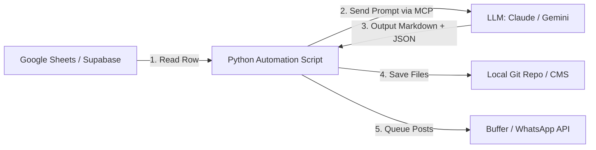

# Relifish Hyperlocal Automation Master Plan & Prompt Suite

This document outlines the final master plan for the Relifish Hyperlocal Content Engine and details the complete copywriting prompts for Facebook, Instagram, and image generation. It also provides the technical blueprint to connect this engine to an Model Context Protocol (MCP) server or automation script to run the 1-year calendar on autopilot.

---

## 1. The Hyperlocal Master Plan: Society-by-Society Density

Before executing any automation, the core strategy must remain **density-first** rather than general awareness:
* **The Goal:** Establish a 40% repeat order rate in Thane's active pockets (Hiranandani Estate, Ghodbunder Road, Majiwada, Kasarvadavali) by building a localized "Freshness Trust Layer."
* **The Engine:** Build high-trust WhatsApp micro-communities led by building "Seafood Captains" (local RWA/society influencers) who coordinate weekly group orders.
* **The Content Flywheel:** Use hyper-targeted, outcome-based local content (recipes, Koli seller stories, seasonal guides, and price transparency) to capture demand and feed the WhatsApp groups.

---

## 2. Multi-Platform Copywriting Prompts

Use these targeted prompts in your AI workflow to generate highly localized copy that avoids generic "AI-speak" and sounds authentic to Mumbai.

### Prompt A: The Facebook & Instagram Copy Generator
```text
You are the Brand Copywriter and Social Media Director for Relifish.
Generate 3 distinct social media copy variations (Facebook/Instagram) for the following Blog Topic.

Inputs:
- [Blog Topic]: {TOPIC}
- [Target Locality]: {LOCALITY} (e.g., Hiranandani Estate Thane)
- [Target Persona]: {PERSONA} (e.g., Working Couple / Health-Conscious Parent)

Style Requirements:
- Use Hinglish (Hindi-English mix) naturally with some Marathi words (e.g., "tai," "bhai," "taza," "curry cut," "mandi"). No awkward translations.
- Use street-smart, warm, food-obsessed language. Never sound corporate or academic.
- Focus on the outcome: convenience, freshness, no market smell, safe for kids, time saved.
- Emphasize the direct link to the local fisherman/koli seller.

For each of the 3 variations, output:
1. **Hook:** A punchy first line that calls out the locality or the daily pain point.
2. **Body Copy:** Short, readable lines (max 4-5 sentences) detailing the outcome and convenience.
3. **CTA:** Click-to-WhatsApp link trigger or waitlist link with coupon code.
4. **Visual Direction:** Detailed description of a photo/video style that should accompany the post.
```

### Prompt B: The Midjourney & DALL-E Image Creator Prompt
```text
You are a food photographer and art director specializing in authentic, raw, natural-light food photography.
Generate 3 image generation prompts (Midjourney format) for a blog/social post about: {SPECIES_OR_TOPIC}.

Art Direction Constraints:
- NO sterile white backgrounds. NO plastic packaging. NO studio lighting.
- Focus on warm, natural morning light (5-7 AM golden hour at the docks, or warm kitchen light).
- Emphasize textures: glistening fish skin, scales, clear eyes, fresh ice, water droplets.
- Keep settings authentic to Mumbai: banana leaves, steel plates, marble kitchen counters, wooden cutting boards.
- Always include human elements: weathered hands cleaning fish, or a home cook marinating.

Output format:
- Prompt 1 (Hero Blog Image - Landscape 16:9): [Midjourney Prompt]
- Prompt 2 (Social Post/Instagram - Square 1:1): [Midjourney Prompt]
- Prompt 3 (WhatsApp Broadcast/Flyer - Vertical 9:16): [Midjourney Prompt]
```

---

## 3. MCP & Automation Integration Blueprint

To automate the 1-year calendar, you can build a script that uses the **Model Context Protocol (MCP)** or a direct API bridge to loop through your content calendar, call the AI model with the master prompts, and publish or queue the outputs.

### The System Architecture



### 1. The Database Schema (Google Sheets or Supabase)
Create a table `content_calendar` with the following columns:
* `month` (e.g., `1`)
* `topic` (e.g., *Where Does Your Sunday Surmai Come From?*)
* `primary_keyword` (e.g., `fresh fish delivery Thane`)
* `target_locality` (e.g., `Hiranandani Estate`)
* `status` (e.g., `pending`, `generated`, `published`)

### 2. The Python Automation Script (Using MCP or API)
This script reads the next pending topic, compiles it using your Master Prompt, and saves the output.

```python
import os
import json
import gspread  # Google Sheets library
from google import genai  # Google Gemini client

# Initialize Google Sheets & Gemini Client
gc = gspread.service_account(filename='service_account.json')
sh = gc.open("Relifish Content Calendar")
worksheet = sh.get_worksheet(0)

client = genai.Client()

# Load the Master Prompt
MASTER_PROMPT_TEMPLATE = """
You are the Content Director, Chief SEO Architect, and Consumer Psychologist for Relifish.
Topic: {topic}
Primary Keyword: {keyword}
Locality: {locality}

Generate the full blog article in markdown, along with:
1. Meta Description
2. WhatsApp Broadcast message (Hinglish)
3. Facebook/Insta Copy
4. Midjourney Image Prompts

Output as clean JSON.
"""

def generate_next_campaign():
    # Find the first row with 'pending' status
    records = worksheet.get_all_records()
    for index, row in enumerate(records):
        if row['status'] == 'pending':
            row_num = index + 2  # 1-indexed, account for header
            print(f"Generating campaign for: {row['topic']}...")

            # Compile prompt
            prompt = MASTER_PROMPT_TEMPLATE.format(
                topic=row['topic'],
                keyword=row['primary_keyword'],
                locality=row['target_locality']
            )

            # Call Gemini 1.5 Pro or Gemini 2.0 Flash
            response = client.models.generate_content(
                model='gemini-2.0-flash',
                contents=prompt,
                config=genai.types.GenerateContentConfig(
                    response_mime_type="application/json"
                )
            )

            campaign_data = json.loads(response.text)

            # Save Blog Post to Git workspace
            slug = row['topic'].lower().replace(" ", "-").replace("?", "").replace(":", "")
            blog_path = f"src/content/blog/{slug}.md"
            with open(blog_path, "w") as f:
                f.write(campaign_data['blog_content'])

            print(f"Saved blog post to: {blog_path}")

            # Save social assets to a local JSON folder for Buffer/WhatsApp API integration
            asset_path = f"public/assets/campaigns/{slug}.json"
            with open(asset_path, "w") as f:
                json.dump(campaign_data, f, indent=2)

            # Update status in Google Sheets
            worksheet.update_cell(row_num, 5, "generated")
            print("Successfully updated database status to 'generated'.")
            break

if __name__ == "__main__":
    generate_next_campaign()
```

### 3. Automatically Publishing & Scheduling
* **Git Commit:** Hook your script into your GitHub Actions pipeline. When a new blog file is created in `src/content/blog/`, Vercel automatically redeploys the site and renders the page.
* **Buffer/Zapier Hook:** Set up a Zapier trigger that watches for new JSON files in `public/assets/campaigns/`. When a new file is detected, parse the JSON and queue the Instagram/Facebook copy, along with the generated image, directly into Buffer or Hootsuite.
