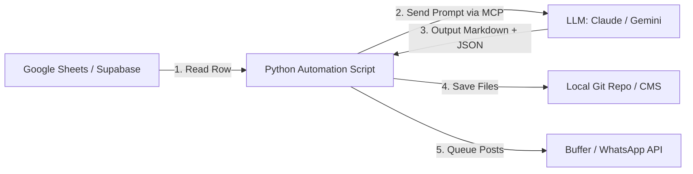
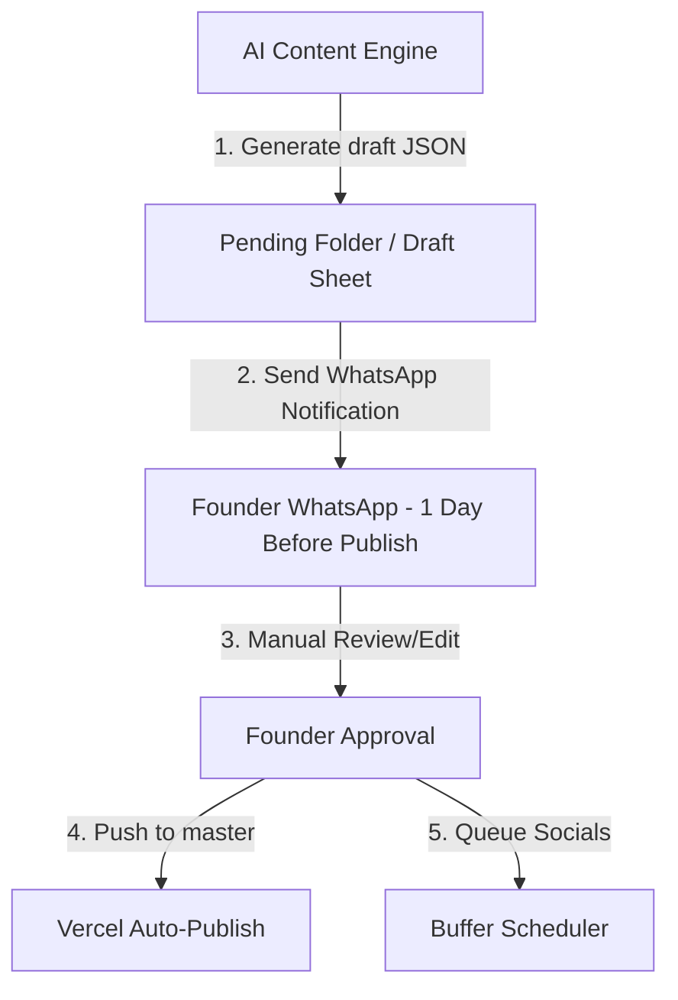

# Relifish Hyperlocal Automation Master Plan & Prompt Suite

This document outlines the final master plan for the Relifish Hyperlocal Content Engine and details the complete copywriting prompts for Facebook, Instagram, and image generation. It also provides the technical blueprint to connect this engine to an Model Context Protocol (MCP) server or automation script to run the 1-year calendar on autopilot.

---

## 1. The Hyperlocal Master Plan: Society-by-Society Density

Before executing any automation, the core strategy must remain **density-first** rather than general awareness:
* **The Goal:** Establish a 40% repeat order rate in Thane's active pockets (Hiranandani Estate, Ghodbunder Road, Majiwada, Kasarvadavali) by building a localized "Freshness Trust Layer."
* **The Engine:** Build high-trust WhatsApp micro-communities led by building "Seafood Captains" (local RWA/society influencers) who coordinate weekly group orders.
* **The Content Flywheel:** Use hyper-targeted, outcome-based local content (recipes, Hyperlocal seller stories, seasonal guides, and price transparency) to capture demand and feed the WhatsApp groups.

---

## 2. Multi-Platform Copywriting Prompts

Use these targeted prompts in your AI workflow to generate highly localized copy that avoids generic "AI-speak" and sounds authentic to Mumbai.

### Prompt A: The Facebook & Instagram Copy Generator
```text
You are the Brand Copywriter and Social Media Director for Relifish.
Generate 3 distinct social media copy variations (Facebook/Instagram) for the following Blog Topic.

Inputs:
- [Blog Topic]: {TOPIC}
- [Target Locality]: {LOCALITY} (e.g., Hiranandani Estate Thane)
- [Target Persona]: {PERSONA} (e.g., Working Couple / Health-Conscious Parent)

Style Requirements:
- Use Hinglish (Hindi-English mix) naturally with some Marathi words (e.g., "tai," "bhai," "taza," "curry cut," "mandi"). No awkward translations.
- Use street-smart, warm, food-obsessed language. Never sound corporate or academic.
- Focus on the outcome: convenience, freshness, no market smell, safe for kids, time saved.
- Emphasize the direct link to the local fisherman/hyperlocal seller.

For each of the 3 variations, output:
1. **Hook:** A punchy first line that calls out the locality or the daily pain point.
2. **Body Copy:** Short, readable lines (max 4-5 sentences) detailing the outcome and convenience.
3. **CTA:** Click-to-WhatsApp link trigger or waitlist link with coupon code.
4. **Visual Direction:** Detailed description of a photo/video style that should accompany the post.
```

### Prompt B: The Midjourney & DALL-E Image Creator Prompt
```text
You are a food photographer and art director specializing in authentic, raw, natural-light food photography.
Generate 3 image generation prompts (Midjourney format) for a blog/social post about: {SPECIES_OR_TOPIC}.

Art Direction Constraints:
- NO sterile white backgrounds. NO plastic packaging. NO studio lighting.
- Focus on warm, natural morning light (5-7 AM golden hour at the docks, or warm kitchen light).
- Emphasize textures: glistening fish skin, scales, clear eyes, fresh ice, water droplets.
- Keep settings authentic to Mumbai: banana leaves, steel plates, marble kitchen counters, wooden cutting boards.
- Always include human elements: weathered hands cleaning fish, or a home cook marinating.

Output format:
- Prompt 1 (Hero Blog Image - Landscape 16:9): [Midjourney Prompt]
- Prompt 2 (Social Post/Instagram - Square 1:1): [Midjourney Prompt]
- Prompt 3 (WhatsApp Broadcast/Flyer - Vertical 9:16): [Midjourney Prompt]
```

---

## 3. MCP & Automation Integration Blueprint

To automate the 1-year calendar, you can build a script that uses the **Model Context Protocol (MCP)** or a direct API bridge to loop through your content calendar, call the AI model with the master prompts, and publish or queue the outputs.

### The System Architecture



### 1. The Database Schema (Google Sheets or Supabase)
Create a table `content_calendar` with the following columns:
* `month` (e.g., `1`)
* `topic` (e.g., *Where Does Your Sunday Surmai Come From?*)
* `primary_keyword` (e.g., `fresh fish delivery Thane`)
* `target_locality` (e.g., `Hiranandani Estate`)
* `google_flow_media_url` (The URL to the high-quality photos/videos stored in your Google Flow asset folder)
* `status` (e.g., `pending`, `generated`, `published`)

### 2. The Python Automation Script (Using MCP or API)
This script reads the next pending topic, pulls the verified media URL from Google Flow, compiles it using your Master Prompt, and saves the output.

```python
import os
import json
import gspread  # Google Sheets library
from google import genai  # Google Gemini client

# Initialize Google Sheets & Gemini Client
gc = gspread.service_account(filename='service_account.json')
sh = gc.open("Relifish Content Calendar")
worksheet = sh.get_worksheet(0)

client = genai.Client()

# Load the Master Prompt
MASTER_PROMPT_TEMPLATE = """
You are the Content Director, Chief SEO Architect, and Consumer Psychologist for Relifish.
Topic: {topic}
Primary Keyword: {keyword}
Locality: {locality}

Generate the full blog article in markdown, along with:
1. Meta Description
2. WhatsApp Broadcast message (Hinglish)
3. Facebook/Insta Copy
4. Midjourney Image Prompts (for additional assets if needed)

Output as clean JSON.
"""

def generate_next_campaign():
    # Find the first row with 'pending' status
    records = worksheet.get_all_records()
    for index, row in enumerate(records):
        if row['status'] == 'pending':
            row_num = index + 2  # 1-indexed, account for header
            print(f"Generating campaign for: {row['topic']}...")
            
            # Map media asset directly from Google Flow URL in the Google Sheet
            google_flow_image_url = row.get('google_flow_media_url', '')

            # Compile prompt
            prompt = MASTER_PROMPT_TEMPLATE.format(
                topic=row['topic'],
                keyword=row['primary_keyword'],
                locality=row['target_locality']
            )

            # Call Gemini 1.5 Pro or Gemini 2.0 Flash
            response = client.models.generate_content(
                model='gemini-2.0-flash',
                contents=prompt,
                config=genai.types.GenerateContentConfig(
                    response_mime_type="application/json"
                )
            )

            campaign_data = json.loads(response.text)
            
            # Embed the real Google Flow media asset URL in the campaign bundle
            campaign_data['google_flow_media_url'] = google_flow_image_url

            # Save Blog Post to Git workspace
            slug = row['topic'].lower().replace(" ", "-").replace("?", "").replace(":", "")
            blog_path = f"src/content/blog/{slug}.md"
            with open(blog_path, "w") as f:
                f.write(campaign_data['blog_content'])

            print(f"Saved blog post to: {blog_path}")

            # Save social assets to a local JSON folder for Buffer/WhatsApp API integration
            asset_path = f"public/assets/campaigns/{slug}.json"
            with open(asset_path, "w") as f:
                json.dump(campaign_data, f, indent=2)

            # Update status in Google Sheets
            worksheet.update_cell(row_num, 6, "generated")
            print("Successfully updated database status to 'generated'.")
            break

if __name__ == "__main__":
    generate_next_campaign()
```

### 3. Automatically Publishing & Scheduling

To achieve a fully automated setup, use the official **Meta Graph API** to publish your generated images and captions directly to Instagram Business and Facebook Pages.

#### Direct Meta Graph API Integration Code (Python)
Add this helper function to your automation pipeline to auto-publish assets:

```python
import os
import requests

def auto_publish_to_meta(image_url, caption):
    """
    Publishes the generated image and caption directly to Instagram Business
    and Facebook Page endpoints using the Meta Graph API.
    """
    META_ACCESS_TOKEN = os.getenv("META_ACCESS_TOKEN")
    INSTAGRAM_BUSINESS_ACCOUNT_ID = os.getenv("INSTAGRAM_BUSINESS_ACCOUNT_ID")
    FACEBOOK_PAGE_ID = os.getenv("FACEBOOK_PAGE_ID")

    # ──── 1. INSTAGRAM PUBLISHING FLOW ────
    # Step A: Create the Instagram Media Container
    ig_container_url = f"https://graph.facebook.com/v19.0/{INSTAGRAM_BUSINESS_ACCOUNT_ID}/media"
    ig_container_payload = {
        'image_url': image_url,
        'caption': caption,
        'access_token': META_ACCESS_TOKEN
    }
    ig_container_res = requests.post(ig_container_url, data=ig_container_payload)
    
    if ig_container_res.status_code == 200:
        creation_id = ig_container_res.json().get("id")
        print(f"Instagram container created successfully. ID: {creation_id}")
        
        # Step B: Publish the Media Container
        ig_publish_url = f"https://graph.facebook.com/v19.0/{INSTAGRAM_BUSINESS_ACCOUNT_ID}/media_publish"
        ig_publish_payload = {
            'creation_id': creation_id,
            'access_token': META_ACCESS_TOKEN
        }
        ig_publish_res = requests.post(ig_publish_url, data=ig_publish_payload)
        if ig_publish_res.status_code == 200:
            print("Successfully published post to Instagram Business!")
        else:
            print(f"Failed to publish container on Instagram: {ig_publish_res.text}")
    else:
        print(f"Failed to create Instagram media container: {ig_container_res.text}")

    # ──── 2. FACEBOOK PAGE PUBLISHING FLOW ────
    fb_publish_url = f"https://graph.facebook.com/v19.0/{FACEBOOK_PAGE_ID}/photos"
    fb_payload = {
        'url': image_url,
        'message': caption,
        'access_token': META_ACCESS_TOKEN
    }
    fb_res = requests.post(fb_publish_url, data=fb_payload)
    if fb_res.status_code == 200:
        print("Successfully published post to Facebook Page!")
    else:
        print(f"Failed to publish on Facebook Page: {fb_res.text}")

# Example Usage:
# auto_publish_to_meta(
#     image_url="https://relifish.store/assets/campaigns/surmai-hero.jpg",
#     caption="Aaj ka catch: Fresh Surmai direct from Versova dock... 🐟"
# )
```

#### Alternate No-Code / Low-Code Publishing Pipeline:
1. **GitHub Trigger:** Hook your script into your GitHub Actions pipeline. When a new blog file is created in `src/content/blog/`, Vercel automatically redeploys the site and renders the page.
2. **Zapier/Make.com Hook:** Set up a Zapier trigger that watches for new JSON files in `public/assets/campaigns/`. When a new file is detected, parse the JSON and pass the caption and image URL directly to the **Instagram for Business** Zapier integration.
- **Buffer API:** Send the generated assets directly to the Buffer API queue to manage schedules and timings.

---

## 4. The Double-Loop Review Pipeline (Editorial & Customer Feedback)

To protect the brand from generic AI outputs and establish high customer trust, the automation engine operates on a double-loop review pipeline.

### Loop 1: Editorial & Pre-Publishing Review Pipeline
Before any generated blog post, Instagram carousel, or WhatsApp broadcast goes live, it must pass through a human approval gate:



1. **Generation Gate:** The Python script deposits the AI outputs into a `public/assets/campaigns/draft-[slug].json` file.
2. **WhatsApp Review Ping (1 Day Prior):** The automation script triggers a WhatsApp notification directly to the founder **exactly 24 hours before the scheduled post time**, sending the raw copy, image prompts, and target tower tags for quick approval.
3. **Review/Sanitization Check:**
   - **Quality Check:** Ensure the content contains no AI buzzwords (e.g., "delve," "testament").
   - **Hyperlocal Verification:** Ensure the localized society names and landmarks are correct.
   - **Marathi/Hinglish Verification:** Ensure the phonetically written Marathi reads naturally.
4. **Approval Trigger:** Once approved by the founder, renaming the file to `[slug].json` triggers the push to production and schedules the social posts.


---

### Loop 2: Customer Feedback & UGC Review Pipeline
Capturing and amplifying trust signals dynamically:

1. **The Post-Purchase Trigger:** 2 hours after order fulfillment, the buyer receives an automated WhatsApp message:
   > *"Hi {name}! How was the fresh {species} you bought from {seller_name} today? Rate it 1-5. If you loved it, reply with a photo of your cooked dish! Best photo wins Rs. 200 wallet credits."*
2. **Dynamic Review Moderation:**
   - **If rating is 4-5 Stars:**
     * Automatically log review to the Supabase database.
     * Render the rating badge (`⭐ 4.8+`) dynamically on the seller's profile page.
     * Send a follow-up WhatsApp: *"Thank you! If you have 15 seconds, please review us on Google Business: [Google Review Link]"*
   - **If rating is 1-3 Stars (Crisis Protocol):**
     * Stop automatic logging. Flag the order immediately in the admin dashboard.
     * Trigger immediate admin WhatsApp notification for customer service outreach.
     * Send instant response: *"So sorry about your experience. Our team is contacting you now to issue a full refund."*
3. **UGC Repurposing Loop:** Approved customer food photos are automatically pulled into the social media asset bank to be used as social proof in future carousels.

---

## 5. Next Steps, OKRs, & Required Tokens

### OKRs (Objectives and Key Results)

#### Objective 1: Dominate Hyperlocal Density in Thane West
*   **KR 1.1:** Achieve 150 weekly orders from Hiranandani Estate & Majiwada (combined) within 90 days of launch.
*   **KR 1.2:** Onboard at least 8 "Seafood Captains" across key residential towers to coordinate group order batches.
*   **KR 1.3:** Maintain a Customer Acquisition Cost (Obtained organically) under Rs. 75 per first order using organic referral loops.

#### Objective 2: Establish Genuinely Fresh Authority (Trust Metric)
*   **KR 2.1:** Maintain a Month-1 repeat purchase rate of >45% among first-time buyers.
*   **KR 2.2:** Gather 50+ Google Business Profile and local community WhatsApp reviews with photo proof within 60 days.
*   **KR 2.3:** Maintain an Average Order Value (AOV) above Rs. 850 by leveraging family bundles and thalis.

---

### Required Integration Tokens
To activate the automation script and hook the calendar into real social networks, configure these environment variables in your deployment settings:

1.  **`META_ACCESS_TOKEN`:** A Page Access Token (extended/never-expiring) generated from the Meta Developer Console with `instagram_basic`, `instagram_content_publish`, and `pages_read_engagement` scopes.
2.  **`INSTAGRAM_BUSINESS_ACCOUNT_ID`:** The unique business ID of the linked Instagram Professional Account.
3.  **`FACEBOOK_PAGE_ID`:** The ID of the linked Facebook Page serving the target area.
4.  **`GEMINI_API_KEY` (or `CLAUDE_API_KEY`):** To run the content compiler prompts programmatically.
5.  **`service_account.json`:** A Google Cloud service account key file with read/write access to the Google Sheet hosting your content calendar.

---

### Action Plan & Next Steps
1.  **Run the Phase 1 Concierge Test:** Select 15 target families in a single tower. Coordinate manually via WhatsApp this Friday night to prove they will buy.
2.  **Set up the Google Sheet Database:** Populate the Sheet with the 12-month calendar rows.
3.  **Deploy the Automation Script:** Run the python compiler script on a cron job or locally before the weekend catch drops.
