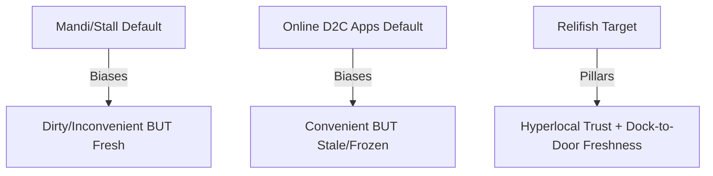
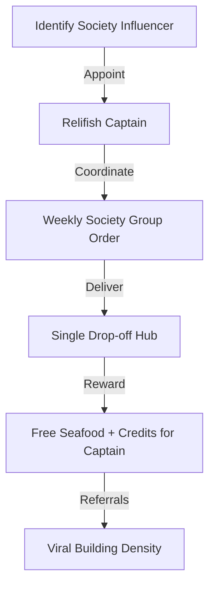

# The Hyperlocal Seafood Trust Engine: Orchestration & Psychology Playbook

*Author: Antigravity*  
*Target Brand: Relifish (Thane)*  
*Objective: Document the deep strategic psychology, market dynamics, and operational orchestration of a density-first fresh food marketplace.*

---

## Chapter 1: The Psychology of Freshness & Food Trust in India

To change consumer behavior in a fragmented market, you must first understand the default biases and anxieties that govern how Indian households buy seafood.



### 1. The "Freshness Bias" & The Mandi Illusion
The default Indian consumer belief is: **"If it is packaged and sold online, it must be frozen and stale."** 
* Surprisingly, consumers choose the local *mandi* (fish market) despite the smell, slime, and bargaining, because they can physically see the fish on ice, touch the flesh, check the gills, and look at the eyes. The chaos of the mandi serves as a **trust signal** of authenticity.
* Corporate D2C apps (Licious, FreshToHome) sanitize the experience so much that it triggers skepticism. The clean, plastic-wrapped tray feels "industrial" and "processed."

### 2. Cognitive Biases Applied to Relifish

#### Loss Aversion (The Sunday Dinner Anxiety)
In seafood-loving households (coastal Maharashtrian, Bengali, Koli), the Sunday afternoon meal is a sacred family ritual. 
* A bad batch of Surmai doesn't just represent a loss of Rs. 600; it represents the **loss of the entire family Sunday experience**. The emotional cost of a ruined meal is 10x higher than the financial cost.
* **Relifish Play:** Frame our service as the ultimate insurance policy for the Sunday feast. We guarantee dock-to-door transit under 4 hours, ensuring the Sunday meal is perfect.

#### The Pratfall Effect (The Power of Honesty)
Corporate brands pretend they have an infinite, perfect supply chain. Relifish does the opposite:
* **The Play:** Proactively state: *"Today the sea was rough. Vinod Patil only caught 15kg of Pomfret, and it sold out by 9:30 AM. We are sorry. We don't source from cold storages to fill the gap. If you missed out, pre-order for tomorrow."*
* **The Result:** Admitting a limitation (stockout due to sea conditions) makes your freshness claim **100% believable**. It proves you do not sell stale, warehouse-stored fish.

#### Regret Aversion (The Kitchen Smell Barrier)
A major barrier for occasional buyers is the mess and smell of cleaning fish at home.
* **The Play:** Offer premium "cleaned, cut, and ready-to-cook" options with a **"No-Odour" guarantee**. Pack with active cooling (reusable gel ice packs) to ensure the fish never reaches a temperature where bacteria grow and create that typical fishy smell.

---

## Chapter 2: Sourcing, Docks, & Fish Economics

You cannot build a sustainable marketplace unless you master the unit economics and dock dynamics of Mumbai's fishing trade.

### 1. The Dock Auction Dynamics (Sassoon Dock vs. Versova)
* Docks operate on a Dutch auction system starting at 4:00 AM. Middlemen (aggregators) buy in bulk, load into trucks, transport to regional wholesale markets (like Crawford Market or Dadar), where retail sellers buy them, load them onto auto-rickshaws, and bring them to local neighborhood stalls.
* **The Markup:** By the time the fish reaches a stall in Thane, it has passed through 3 middlemen and sat in melting ice for 12–24 hours. The price has inflated by 40–50%.
* **The Relifish Disruption:** We bypass the wholesale middlemen. The local Koli seller lists their catch directly on Relifish at dock-out rates. We pick it up directly from the dock/seller landing site and bring it to Thane, keeping the price fair and the fish fresh.

### 2. The Seasonality & Tide Playbook

```
Spring Tides (New/Full Moon) ➔ Strong Currents ➔ Glistening Pelagic Catch (Pomfret, Surmai)
Neap Tides (Half Moon)       ➔ Calm Water     ➔ High Demersal Catch (Prawns, Crabs, Lobster)
```

* **Monsoon Ban (June 1 – July 31):** Deep-sea trawling is banned along the Maharashtra coast to allow breeding. Educate your users about this. Explain that anyone selling "fresh wild Pomfret" in July is selling cold-stored frozen stock. Teach them to buy fresh river fish (Rohu, Catla), shellfish (crabs/clams), or Koli dried fish (Sukha Bombil) during these 60 days. This makes you an educator, not a salesperson.

---

## Chapter 3: Orchestrating the Hyperlocal "Seafood Captain" Loop

Digital advertising platforms (Facebook/Google) are highly inefficient for local food marketplaces. The geographic targeting is too broad, leading to high CAC and low delivery density. The solution is the **Seafood Captain Model**.



### 1. The RWA / Society Dynamic in Thane
Thane is characterized by massive, self-contained residential complexes (e.g., Hiranandani Estate, Lodha Paradise, Rustomjee Urbania). These complexes have active internal WhatsApp groups, cultural committees, and resident welfare associations (RWAs).
* If you target individuals, you pay Rs. 150+ in digital CAC and deliver 1 package per building.
* If you target the **community**, you win the entire building.

### 2. The Operational SOP for the "Captain" Loop
1. **Recruitment:** Identify a resident who is a foodie, active in the society's cultural committee, and respected in the building's WhatsApp group.
2. **The Offer:** Appoint them as the "Relifish Captain" for their tower/complex. They receive a weekly complimentary box of premium fresh catch (value: Rs. 500) and a custom dashboard link.
3. **The Group Order Hook:** Every Thursday morning, the Captain shares the custom group order link in the society WhatsApp group:
   > *"Hi neighbors! I'm coordinating our weekly fresh catch order from Relifish for Saturday morning. The boat leaves Versova tomorrow. Tap to add your choice to our building's bulk drop-off for free delivery: [Link]"*
4. **Logistics Consolidation:** The orders are compiled into a single delivery batch. A single rider drops off the ice-boxed packages at the Captain's lobby or doorstep on Saturday morning.
5. **The Outcome:** You achieve **maximum route density** (15 orders in 1 stop), drop delivery costs to near-zero, and acquire users via word-of-mouth trust.

---

## Chapter 4: The 360° Multi-Channel Orchestration

An effective content engine must be a closed-loop system where every channel reinforces the other. Here is how one single piece of dock news propagates through the system:

```
[4:30 AM Catch Dock Update] 
      ➔ [Post Live Menu Update on Website]
      ➔ [Auto-Send WhatsApp Daily Alert to Buyers]
      ➔ [Founder Records 15s Reel for Instagram/FB]
      ➔ [WhatsApp Group Chat testimonials drive orders]
      ➔ [Local Referral Loop triggers neighbors]
```

### 1. The Sourcing Event
A seller lists a rare catch (e.g., a massive 4kg Ghol / Sea Gold) at the Versova dock at 5:00 AM.

### 2. Digital Menu Sync
The listing goes live on the marketplace. The website shows: `Caught at 4:15 AM by Vinod Patil. Only 1 left.`

### 3. The Push Loop (WhatsApp & Push Notifications)
The database triggers a localized WhatsApp alert to Thane West subscribers:
> *"Aila! Vinod Patil just landed a 4kg Ghol (Sea Gold) at Versova. Standard steaks are priced at Rs. 650/kg. Strictly first-come, first-served. Order now for 11 AM delivery: [Link]"*

### 4. Social Proof & Storytelling (Instagram/Facebook)
The founder uploads a raw 15-second Reel shot at the dock:
* **Visual:** Vinod holding the glistening Ghol.
* **Audio:** Koli chatter in the background.
* **Caption:** Hinglish/Marathi hook detailing the rarity of Ghol and linking to the menu.

### 5. Community Referral Trigger
When the buyer receives the order at 11:00 AM, they receive the post-purchase prompt:
* **The WhatsApp Hook:** *"Hey! Your Ghol curry is going to taste amazing. Take a photo of the curry and share it with your neighbors. If they order using your link, they get Rs. 75 off their first order, and you get Rs. 100."*
* **The Result:** The customer posts the photo to the society WhatsApp group. The loop repeats.
