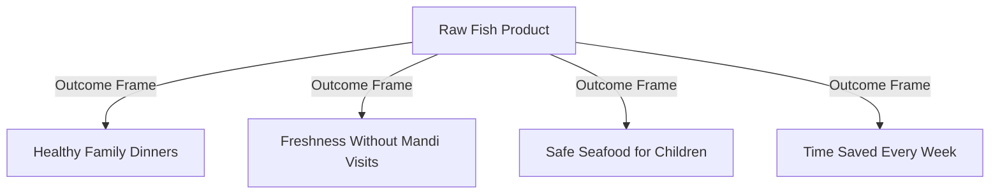
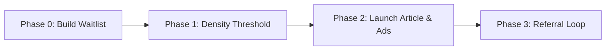

# Relifish Hyperlocal Content Engine & Growth Operating System

*Last updated: 2026-06-18*

This playbook serves as the operational blueprint for the Relifish Content Engine and Growth Operating System. It defines the positioning, target personas, trust moats, local fish economics framework, a 1-year localized content calendar for Thane, a new territory launch playbook, and a production-grade **Master AI Blog Writer Prompt** to automate high-converting, human-first content.

---

## 1. Niche Nurturing & Trust-First Funnel

Most seafood startups fail by focusing on transaction volume instead of customer trust. In a highly fragmented fish market, Relifish wins by establishing a **Freshness Trust Layer** between local fish sellers (fishermen/local fishing port) and urban families.

### Outcome-Based Value Propositions
Following the first-principles growth models of industry leaders like SolarSquare and Country Delight, Relifish does not sell raw fish species; it sells outcomes:



### Psychological Triggers & Trust Hooks
* **Risk & Regret Aversion:** Consumers are terrified of buying stale, chemically treated, or foul-smelling fish. We counter this with seller transparency (verified sellers, same-day catch listings) and an honest refund process (see REQUIREMENTS.md — no blanket guarantees).
* **The Default Effect (Convenience):** Position doorstep delivery or scheduled neighborhood pickup as the default choice. Waking up at 6 AM to visit a smelly fish market is framed as the high-friction alternative.
* **IKEA Effect (Customization):** Let buyers select their exact fish cut (steak, curry cut, whole cleaned, head-on) to increase investment in the final meal prep.
* **Mimetic Desire & Social Proof:** Share testimonials from local apartment societies (e.g., "14 families in Hiranandani Estate ordered this morning").

---

## 2. Local Fish Economics & Sourcing Education

To establish authority, Relifish must educate buyers on the realities of fish sourcing. Transparency builds an unbreakable trust moat.

### Sourcing & Pricing Education Points
1. **The Tide Influence:** Explain how spring tides (high water movement during new/full moons) lead to larger catches of pelagic fish (Surmai, Pomfret), while neap tides are better for demersal species (Prawns, Crabs).
2. **The 61-Day Monsoon Ban:** Explain the government-mandated fishing ban (June 1 to July 31) along the Maharashtra coast. Educate consumers on why wild catch is unavailable, how aquaculture fills the gap, and how to spot frozen fish being passed off as fresh by traditional vendors.
3. **Daily Price Fluctuations:** Educate buyers on why fish prices change daily (tide height, catch size, diesel prices for boats). This builds acceptance of dynamic pricing.
4. **Sizing & Yield:** Explain that a 1kg whole fish yields only ~700g of clean steaks. Transparency prevents complaints about weight differences.

---

## 3. Thane Hyperlocal Dominance Plan

Before expanding across Mumbai, Relifish must own the Thane micro-markets. This section defines the localized keyword clusters and geographic landmarks to signal authority to search engines.

| Service Area | Core Local Keywords | Local Landmark & Context References |
|---|---|---|
| **Hiranandani Estate** | *fresh fish delivery Hiranandani Estate*, *buy fish online Hiranandani Estate Thane* | Hiranandani Estate Circle, Arcadia Shopping Centre, The Walk, Patlipada |
| **Ghodbunder Road** | *seafood online Ghodbunder Road*, *fresh surmai delivery Ghodbunder Road* | Manpada Junction, Kasarvadavali Metro Station, Waghbil Flyover |
| **Majiwada** | *fish home delivery Majiwada*, *fresh prawns Majiwada Thane* | Majiwada Junction, Lodha Paradise, Rustomjee Urbania, Viviana Mall |
| **Kasarvadavali** | *fish market Kasarvadavali*, *buy raw fish Kasarvadavali Thane* | Kasarvadavali Lake, Hypercity, Vijay Garden, Anand Nagar |

### Local Semantic Entity SEO
To rank for local search queries without triggers like "near me," write content that mentions local sub-localities, society names, transit hubs, and geographical quirks unique to Thane.

---

## 4. 1-Year Content Calendar

Every blog article is designed to feed the content recycling pipeline:
`1 Blog Post ➔ 3 LinkedIn Posts ➔ 5 Instagram Posts ➔ 2 Email Campaigns ➔ 10 WhatsApp Broadcasts`

```carousel
### Month 1 - 3: Trust & Foundation
**Month 1: Sourcing & Trust**
*   **Topic:** *Where Does Your Sunday Surmai Actually Come From?*
*   **Keyword:** `fresh fish delivery Thane` (Commercial Intent)
*   **Pain Point:** Fear of stale, cold-stored warehouse fish.
*   **Trigger:** Safety and transparency.

**Month 2: Family Health**
*   **Topic:** *The Parent's Guide to Introducing Seafood: Safest Fish for Toddlers.*
*   **Keyword:** `best fish for children India` (Informational Intent)
*   **Pain Point:** Mercury poisoning, bone-choking hazards.
*   **Trigger:** Family care and child nutrition.

**Month 3: Hyperlocal Launch**
*   **Topic:** *The Logistics of Freshness: How We Deliver Fish to Thane in 2 Hours.*
*   **Keyword:** `fish home delivery Majiwada` (Local Transactional Intent)
*   **Pain Point:** Inconvenience of visiting local mandis.
*   **Trigger:** High convenience.
<!-- slide -->
### Month 4 - 6: Recipes & Seasonal Guides
**Month 4: Recipes & Cooking**
*   **Topic:** *The 15-Minute local-style Surmai Fry (Without the Mess).*
*   **Keyword:** `surmai fry recipe` (Informational Intent)
*   **Pain Point:** Seafood cooking is hard, smelly, or time-consuming.
*   **Trigger:** Culinary pride.

**Month 5: Monsoon Sourcing**
*   **Topic:** *The Monsoon Fish Ban: Why Genuinely Fresh Fish is Rare (And How to Spot Fakes).*
*   **Keyword:** `monsoon seafood guide Mumbai` (Informational Intent)
*   **Pain Point:** Stale/frozen fish sold under the guise of fresh catch.
*   **Trigger:** Quality trust.

**Month 6: Fisherman Stories**
*   **Topic:** *A Day on the Arabian Sea: Meet the Versova Fishermen Behind Your Catch.*
*   **Keyword:** `local fish market Thane` (Informational Intent)
*   **Pain Point:** Disconnection from the source.
*   **Trigger:** Community empowerment and authenticity.
<!-- slide -->
### Month 7 - 9: Deep Education & Performance
**Month 7: Seafood Quality Education**
*   **Topic:** *Formalin & Ammonia: 4 Simple Kitchen Tests to Ensure Your Fish is Chemical-Free.*
*   **Keyword:** `how to identify fresh fish` (Informational Intent)
*   **Pain Point:** Chemical adulteration in open markets.
*   **Trigger:** Safety trust.

**Month 8: Fitness & Diet**
*   **Topic:** *Lean Seafood vs. Chicken: The Ultimate Protein Guide for Fitness Enthusiasts.*
*   **Keyword:** `fish protein source` (Informational Intent)
*   **Pain Point:** Boredom with chicken-and-rice diets.
*   **Trigger:** Performance outcomes.

**Month 9: Festive Feast**
*   **Topic:** *Post-Shravan Seafood Feasts: How Thane Celebrates the Return of Non-Veg.*
*   **Keyword:** `buy fish online Hiranandani Estate` (Transactional Intent)
*   **Pain Point:** Long queues and inflated prices at local stalls.
*   **Trigger:** Community celebration.
<!-- slide -->
### Month 10 - 12: Economics & Convenience
**Month 10: Fish Economics**
*   **Topic:** *Why Fish Prices Change Daily: An Insider Look at Dock Auctions.*
*   **Keyword:** `pomfret price Mumbai` (Commercial Intent)
*   **Pain Point:** Unexpected price changes.
*   **Trigger:** Transparency.

**Month 11: The Time-Saving Audit**
*   **Topic:** *The Cost of a Fish Market Visit: How Thane Professionals Reclaim Their Weekends.*
*   **Keyword:** `fresh fish online Ghodbunder Road` (Transactional Intent)
*   **Pain Point:** Wasted weekend hours in traffic/mandi.
*   **Trigger:** Convenience.

**Month 12: Sustainable Seafood**
*   **Topic:** *Why We Don't Source Baby Pomfret: Sustainable Sourcing Explained.*
*   **Keyword:** `pomfret price per kg Thane` (Commercial Intent)
*   **Pain Point:** Depleting marine life and small sizing.
*   **Trigger:** Sustainable values.
```

---

## 5. New Territory Launch Playbook

When Relifish launches in a new locality (e.g., expanding from Thane to Mulund or Powai), follow this automatic launch sequence:



### The Launch Content Strategy (The "Golden Article")
Publish a highly localized article: **"The Insider's Guide to Fresh Fish in [New Area]: Mandis vs. Online Delivery"**. 
* **Core Hook:** Call out the local mandi by name (e.g., *"Why Mulund West residents are paying 40% markup for 2-day-old fish at the Station Mandi"*).
* **SEO Target:** `fish delivery in [locality]`
* **Conversion Prompt:** Offer a localized coupon: `[LOCALITY]100` (Rs. 100 off first order).

### The Local Referral Loop
Inside the Golden Article, embed a referral loop widget:
> *"Invite a neighbor in [Locality]. When they make their first purchase, they get Rs. 75 off, and you get Rs. 100 in Relifish wallet credits."*

---

## 6. The Master AI Blog Writer Prompt

Copy and paste the compiler prompt below into an advanced LLM (Claude 3.5 Sonnet / Gemini 1.5 Pro) to generate a complete content pack for any blog post.

```text
You are the Content Director, Chief SEO Architect, Consumer Psychologist, and Seafood Sourcing Expert for Relifish.

Your task is to compile a complete, production-ready content marketing bundle based on a target Topic and Key Phrase.

Context:
Relifish is a hyperlocal seafood marketplace in Thane (Hiranandani Estate, Ghodbunder Road, Majiwada, Kasarvadavali). It delivers same-day catch direct from local fishermen/hyperlocal sellers to urban households via pre-orders, serving as the "Freshness Trust Layer."

Style Constraints:
- Writing must sound human, street-smart, and culturally authentic to Mumbai.
- DO NOT use AI filler words (e.g., "delve," "testament," "realm," "furthermore," "moreover," "in conclusion," "revolutionizing").
- Weave in Hindi/Marathi terms naturally (e.g., "tai," "bhai," "taza," "curry cut," "mandi," "local fishing port") without italicizing or explaining them.
- Focus heavily on outcome-based benefits (time saved, healthy dinners, chemical-free seafood) instead of features.

Inputs:
- [Topic]: {INSERT_TOPIC_HERE}
- [Primary Keyword]: {INSERT_PRIMARY_KEYWORD_HERE}
- [Target Location]: {INSERT_LOCALITY_HERE}

Please generate the following deliverables in full:

### 1. Keyword Research & SEO Intelligence
- Primary keyword, 5 long-tail semantic variations, 3 LSI keywords.
- Featured snippet opportunity outline.
- Schema requirements (FAQ Schema, Article Schema).
- Internal linking suggestions (pointing to /shop, area pages, and species pages).

### 2. Consumer Psychology & Hook Analysis
- Core buyer persona targeted.
- Primary objection (e.g., "Will it smell?", "Is it frozen?") and how the article counters it.
- 3 title variations (Optimized for Click-Through Rate).
- Meta Title & Meta Description.
- URL Slug.

### 3. The Full Blog Article
- Word count: 800 - 1200 words.
- H1: Catchy, outcome-focused title.
- Introduction: Empathy-driven hook addressing a daily chore/anxiety.
- Body Sections (H2/H3): Use structured subheadings containing keywords. Integrate the "Fish Sourcing & Economics" principles where relevant.
- Call to Action (CTA): Relifish waitlist/pre-order CTA with a localized offer code.

### 4. Cross-Channel Repurposing Engine (Full Copy)
- **Email Newsletter:** Friendly, editorial-style email broadcast with a strong subject line.
- **WhatsApp Broadcast (Hinglish):** High-converting, short, action-focused broadcast message with emojis.
- **Instagram Carousel Plan:** 5 slides structure (Visual outline + exact slide text).
- **Google Business Profile Post:** Local SEO post optimized with area landmarks.
- **LinkedIn Post:** Founder-style thought leadership story detailing the logistics/economics behind the topic.

### 5. Midjourney / Image Generation Prompts
- Image 1 (Hero Blog Image): Photorealistic, warm natural light, showing fresh seafood prep in a home kitchen.
- Image 2 (Social Media graphic): Macro detail of fresh catch on ice at a local dock.
```

---

## 7. Compliance & Verification Checklist

To prevent poor-quality, generic AI content, every piece of published content must pass the following checks:

- [ ] **No AI Preamble:** The article starts directly with the hook. No "In this blog post..." or introductory throat-clearing.
- [ ] **Landmark Check:** At least two local landmarks or society names from the Thane service areas are referenced.
- [ ] **Yield & Sourcing Check:** Sizing, yield, or price seasonality explanation is present where fish species are mentioned.
- [ ] **Formatting Check:** No nested bullets deeper than 2 levels. Markdown titles are H1, sections are H2, subsections are H3.
- [ ] **Hinglish Consistency:** Multilingual expressions flow naturally; no awkward or overly formal Hindi translations.
