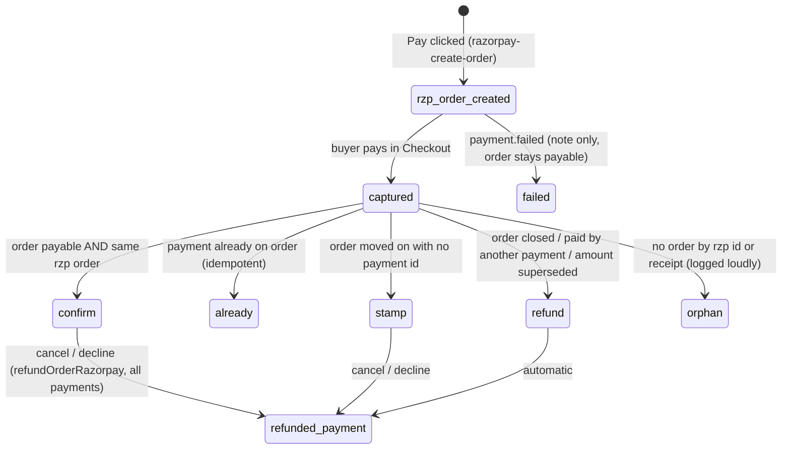
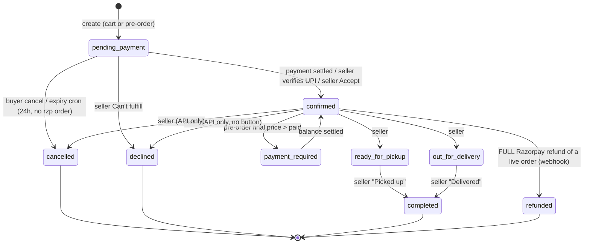
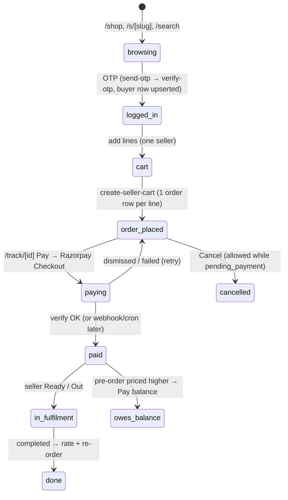
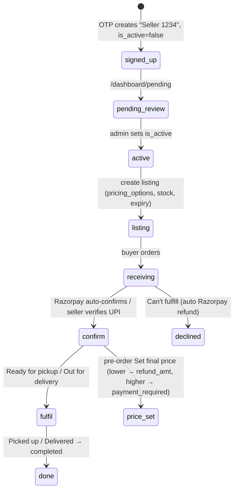

# Relifish system audit — data, state machines, drift, cleanup

Audited 2026-10-08 against **production** Supabase (`witoghpdfocywiosmrzv`, read-only
queries) and the code on branch `kunalrawat425/buyer-contact-leak`.

Status legend: **FIXED** (committed on this branch) · **MIGRATION** (written, not yet
applied to prod) · **OPEN** (identified, not fixed yet).

---

## 1. Data inventory

| Table | Rows | Purpose | Verdict |
|---|---|---|---|
| `orders` | 337 | One row per order line (cart = N rows) | Keep. ~320 rows are test data (§6) |
| `fish_listings` | 68 | Seller stock + `pricing_options` jsonb | Keep. 61 expired but `is_available=true` |
| `sellers` | 24 | Seller profile, hours, delivery config | Keep. 16 are empty OTP sign-ups ("Seller 1234") |
| `buyers` | 25 | Buyer profile, push subscription | Keep |
| `buyer_addresses` | 4 | Saved addresses | Keep. Orders reference it by uuid **in a text column** |
| `buyer_cart` | 1 | Server-side cart | Keep. 1 row points at an unavailable listing |
| `order_feedback` | 4 | Ratings | Keep. Now drives `sellers.rating_*` (070) |
| `otp_codes` | 40 | Current OTP per phone | Keep. Expired plaintext codes purged (070) |
| `push_notification_logs` | 109 | Push delivery audit | Keep. Add retention later |
| `buyer_waitlist` | 8 | Pre-launch waitlist | Keep. `converted_at` never written |
| `species_ranges` | 21 | Admin price bands | Keep |
| `razorpay_payments` | new | Ledger: one row per captured payment | **MIGRATION 069** |
| `otp_attempts` | 10 | Old OTP rate limit (018) | **Drop — MIGRATION 070.** Replaced by `otp_codes` in 052, never removed |
| `price_logs` | 0 | Nothing reads or writes it | **Drop — MIGRATION 070** |
| `seller_schedule_slots` | 0 | Scheduled pickup slots | Feature disabled (create returns 400). Keep for now: `orders.schedule_slot_id` FKs it |
| `seller_schedule_configs` | 0 | Slot config | Same as above |

**Missing table** — there was no record of individual payments. An order holds one
`razorpay_payment_id`, so a pre-order paid upfront + balance lost the first id, and a
payment that arrived after cancel was recorded nowhere. → `razorpay_payments` (069).

`auth.users` is **empty**: nobody uses Supabase Auth. Every RLS policy written against
`auth.uid()` (`get_seller_id()`, `get_buyer_id()`, `is_admin()`) is dead code.

### Unused or redundant columns

| Column | Evidence | Verdict |
|---|---|---|
| `orders.payment_type` | Hardcoded `'cod'` on every create, never updated; all 8 Razorpay rows read "cod" | **FIXED / 069**: derived from `payment_method` by trigger |
| `orders.platform_fee` | 0 on all rows (commission is 0%) | OPEN: drop when convenient |
| `orders.seller_upi_id` | 0 rows, 0 code refs | OPEN: drop |
| `orders.schedule_slot_id` / `scheduled_for` | 0 / 2 rows; feature off | OPEN: drop with schedule tables if the feature is abandoned |
| `orders.refund_screenshot_path` | 0 rows | Keep (UPI refund proof path is live code) |
| `orders.is_preorder` + `placement_kind` | Same fact twice. 0 mismatches today, but two writers | OPEN: derive one from the other |
| `orders.species` | Copy of `fish_listings.species` | Keep: snapshot survives listing deletion |
| `orders.buyer_addr` | 214 uuids into `buyer_addresses` (4 dangling) + 74 free-text | OPEN: store an address **snapshot** at order time |
| `orders.payment_verified_by` | 17 set, FK to sellers | Keep |
| `fish_listings.delivery_avl` | 0 code refs | OPEN: drop |
| `sellers.low_stock_threshold` | 0 code refs (set on 24 rows by default) | OPEN: drop or wire up |
| `sellers.rating_avg`, `total_orders` | Shown publicly, **never written** | **FIXED / 070**: triggers + `rating_count` |
| `buyer_waitlist.converted_at` | Never written | OPEN |

---

## 2. Table optimisation scope

Size is not the problem: the largest table is 312 kB. Correctness is.

| Item | Why | Status |
|---|---|---|
| Unique `orders.razorpay_order_id` / `razorpay_payment_id` (partial, not null) | Webhook and refund look up by these; duplicates would mis-route money. 0 dupes today | **MIGRATION 069** |
| `orders(listing_id, status, created_at desc)` | Seller dashboard filters exactly this | OPEN (cheap, add with lockdown) |
| `orders(buyer_id, created_at desc)` | Buyer /me, /track | OPEN |
| Drop `idx_buyers_auth` | Duplicate of unique `buyers_auth_id_key`; and auth_id is always null | OPEN |
| Unused indexes per advisor: `idx_orders_scheduled`, `idx_listings_available`, push log indexes | Never scanned | OPEN, low value |
| 5 unindexed FKs (advisor) | Tiny tables; only `orders.payment_verified_by` matters for deletes | OPEN, low value |
| `search_path` not pinned on 10 functions | Advisor WARN; hijackable search path | OPEN (lockdown migration) |
| RLS policies calling `auth.uid()` per row | Advisor WARN — and they are dead anyway | OPEN (lockdown migration) |
| No migration tracking on prod (`_migrations` absent) + duplicate numbers 028/029/051/054 | Prod schema drifted from staging before (see BUG-LIST "Schema drift") | OPEN |

---

## 3. Out-of-sync and duplicated data (the "otp_codes vs otp_attempts" pattern)

Every place two copies of a fact can disagree, checked on prod:

| # | Pattern | Prod evidence | Status |
|---|---|---|---|
| 1 | `otp_attempts` vs `otp_codes` — two tables claiming attempt counts | `otp_attempts` last write 2026-05-03; 5/10 rows for phones `otp_codes` never saw | **FIXED / 070** (dropped) |
| 2 | Phone format: `otp_codes` "91XXXXXXXXXX", buyers/sellers 10-digit, orders mixed | orders: 218 `+91…`, 117 10-digit, 2 garbage | **FIXED / 070** (normalise on write + backfill) |
| 3 | `payment_type` vs `payment_method` | 8/8 Razorpay rows say "cod" | **FIXED / 069** |
| 4 | `sellers.rating_avg` vs `order_feedback` | 2 sellers disagree | **FIXED / 070** |
| 5 | `sellers.total_orders` vs completed orders | 5 sellers disagree; SEO `ratingCount` used it | **FIXED / 070** |
| 6 | `orders.razorpay_payment_id` vs actual Razorpay payments | Second/late payments recorded nowhere | **FIXED / 069** (ledger) |
| 7 | `orders.buyer_addr` uuid vs `buyer_addresses` | 4 orders point at deleted addresses → delivery address lost | OPEN (snapshot) |
| 8 | `orders.paid_amount` = what is **owed**, set at INSERT | Read as "paid" in 3 UI places (BUG-42 class) | **FIXED** in /track, seller card, detail |
| 9 | `fish_listings.is_available` vs `expires_at` | 61 expired listings still `is_available=true` | OPEN (readers filter by expiry; cron should flip) |
| 10 | `orders.inventory_deducted` vs status | 21 `completed` rows never marked deducted (pre-067 history) | Leave: historical, 068 deliberately skips terminal rows |
| 11 | `refund_sent_at` without `refund_amt` | 8 rows | OPEN (mark_refund_sent should store the amount) |
| 12 | `final_price` on non-pre-orders | 20 rows | OPEN (set_final_price guard is meaningless, see §5) |
| 13 | `status='cancelled'` without `cancelled_by` | 4 rows (expiry cron) | OPEN |
| 14 | `send-otp` daily cap 30 vs message "3" | Code constant vs copy | **FIXED** (10, message from constant) |
| 15 | Buyer email written from client JSON in verify | Unverified email can land on `buyers.email` | OPEN (session lockdown) |

---

## 4. Other bad patterns found

| Pattern | Where | Status |
|---|---|---|
| OTP from `Math.random` over 4 patterns — ~1,458 codes, not 1,000,000 | `send-otp.ts` | **FIXED** |
| OTP payload (with the code) `console.log`ged | `send-otp.ts` | **FIXED** |
| Missing MSG91 env → `123456` logs into any account | `verify-otp.ts` | **FIXED** (fail closed) |
| Anon key can `SELECT *` every order (phone, address text, notes) | RLS `USING (true)` | OPEN — lockdown |
| Seller dashboard Realtime subscribes to **all** orders | `dashboard/orders/index.astro:457` | OPEN — lockdown |
| "Auth" = id + phone from localStorage; seller phones are public | `assert-seller.ts`, every seller API | OPEN — session tokens (D3) |
| `reconcile_preorder_price` callable by anon, no auth check | DB function | OPEN — lockdown |
| Anon can INSERT orders with any status | RLS `with check (true)` | OPEN — lockdown |
| Write-then-forget UPDATEs with no status guard (race = wrong state) | `cancel.ts:68`, `seller/orders.ts:375` | OPEN — §5 |
| Cart checkout not atomic: line N fails after 1..N-1 created | `create-seller-cart.ts` | OPEN |
| `upload-payment` deletes old files before the DB write; clears `payment_verified_at` on confirmed orders | `upload-payment.ts` | OPEN |
| Server never checks `seller.is_active` / `listing.is_order_paused` at order time | create paths | OPEN |
| Dead code: `/api/orders/create` (no UI caller), `/api/preorders`, `accept_price`/`reject_price`, 8 helpers in `lib/supabase.ts`, bulk-verify button | various | OPEN — delete |

---

## 5. State machines

### 5.1 Payment state machine (per Razorpay payment)

Since 069/the settle module, every captured payment goes through
`settleCapturedPayment` (`src/lib/server/razorpay-ledger.ts`) no matter who sees it first
(verify, webhook, daily cron, admin, seller "Check Razorpay", create-order).



| Order payment view | Meaning | Shown as |
|---|---|---|
| `payment_method=razorpay` + `razorpay_payment_id` | captured online | "Paid online · Razorpay" + ref |
| `payment_verified_at`, no razorpay | seller verified UPI | "Paid via UPI · verified by seller" |
| screenshot only | buyer claims UPI | "UPI proof submitted — seller will verify" |
| `payment_method=cod_legacy` | pre-Razorpay legacy | "Cash on delivery (legacy order)" |
| none | unpaid (`paid_amount` is only what is owed) | "Payment pending" |

### 5.2 Order state machine (`orders.status`)

Live statuses only. **Dead** (no code writes them): `paid`, `picked_up`, `scheduled`,
`pending`, `pre_order`. They exist in the check constraint and UI maps only.



Side effects: stock deducted on insert (same-day) or on → `confirmed` (pending_payment /
pre-order); restored on → `cancelled`/`declined`/`refunded` if it was deducted (067).

**Stuck / wrong exits still OPEN**
- Seller API: statuses missing from the allowed-transition map skip the check, so
  `cancelled → confirmed` is accepted (`seller/orders.ts:276-313`). `refunded` allows
  `ready_for_pickup`/`out_for_delivery`.
- No status guard on the seller UPDATE or buyer cancel UPDATE → cancel racing "Ready"
  can leave a refunded order `ready_for_pickup`.
- `pending_payment` with a Razorpay order but never paid: expiry cron skips it forever.
- `pending_payment` with an unverified UPI screenshot: cron cancels it after 24h.
- Pre-order "Set price" never appears for UI-created pre-orders (cart sets
  `delivery_fee=0`, `paid=total`, the button needs `paid < total+delivery`).
- `reject_price` (no UI) cancels from any status with `final_price`, including `completed`.
- **FIXED:** refund webhook no longer flips cancelled/declined/completed → `refunded`;
  verify accepts `payment_required`; balance top-up can be paid; late/extra payments refunded.

### 5.3 Buyer journey



| Status | /track/[id] buyer sees | /me |
|---|---|---|
| pending_payment | Pay + Cancel | Active, "Complete payment" |
| confirmed | Cut/notes form, payment label + ref | Active |
| payment_required | Pay balance (**now payable**) | Active |
| ready / out | Read-only | Active |
| completed | Rate + Re-order | Past |
| cancelled / declined | Refund block only if actually paid | Past |
| refunded | "Order closed — payment refunded" (**was "confirmed — being prepared"**) | Past |

### 5.4 Seller journey



| Dashboard tab | Statuses | Actions |
|---|---|---|
| New | pending, pending_payment, pre_order, scheduled | Razorpay unpaid: Check Razorpay, Can't fulfill. Paid-but-pending: **Confirm order** (was Ready/Out, which the server rejected). UPI: View proof, Verify, Can't fulfill |
| In progress | confirmed, paid, payment_required, ready_for_pickup, out_for_delivery | Ready / Out / Picked up / Delivered, Set price, Mark refund sent |
| History | picked_up, completed, declined, cancelled, refunded | Mark refund sent (UPI, if actually paid) |

---

## 6. Test data on production

Rule (product owner): **an account with a real name, address or email is real** — kept even
if the phone looks like a dummy. Only identity-less accounts are fake.

| Account | Evidence | Verdict |
|---|---|---|
| Fishy mart, RAJU Fish HUb, Fresh Catch Mumbai | Real names and street addresses (Versova Fish Market, Worli Koliwada, Sassoon Dock), coordinates; Fishy mart has an email | **Keep** |
| Seller 9974 | Email, address | **Keep** — becomes the ₹1 QA seller `TEST Relifish QA` |
| Buyer …9974 | Name, email, 2 saved addresses | **Keep** |
| Seller 0033 | Placeholder name, no address/email, 0 listings | **Delete** |
| Buyers 99001100{11..55}, 9876543210, 9999999999 | No name, no email, no saved address | **Delete** |

`supabase/prod-ops/2026-10-08_test_data_cleanup.sql` backs up then deletes 1 seller, 7 buyers
and 18 orders (none Razorpay-paid, no feedback lost); 319 orders remain. It aborts if any
listed account turns out to have a name, email or address.

**Convention from now on:** `is_test` on sellers/buyers/orders (orders inherit it), names
prefixed `TEST `, `select purge_test_orders();` removes test orders and keeps accounts.

---|---|---|
| Fake sellers | Fishy mart / Fresh Catch Mumbai / RAJU Fish HUb (`98765432 10/11/12`), Seller 0033 (`9900110033`) | 4 sellers, 13 listings, 252 orders |
| Fake buyers | `99001100{11,22,33,44,55}`, `9876543210`, `9999999999` | 7 buyers, 17 orders |
| Dev account | `…9974`: buyer + admin seller "Seller 9974" | 302 orders (7 Razorpay-paid, real money) |
| Empty sign-ups | "Seller NNNN", 0 listings, inactive | 16 sellers |
| Keep | Bombay Sea Food, Ocean Lovers Fish, The fishy spot, buyer `…1990` | ~16 orders |

Decision D2=A: back up, then delete including the 7 Razorpay-paid dev rows. Every
delete runs only after explicit approval (D5=A). The ₹1 test seller is the dev seller
renamed `TEST Relifish QA`, flagged `is_test`, hidden from public lists.

**Convention from now on:** `is_test boolean` on `sellers`, `buyers`, `orders` (orders
inherit it from seller or buyer by trigger), display names prefixed `TEST `. Public
queries filter `is_test = false`. Cleanup is one statement per table in FK order.

---

## 7. Edge cases to test (E2E matrix, staging)

- Concurrency: buyer cancel vs seller Ready; double-click Decline on a Razorpay order;
  two Set-price requests; webhook vs verify (only the winner notifies).
- Payment after cancel/decline → automatic refund + note (**now handled**).
- Two tabs paying the same order → second payment refunded (**now handled**).
- Pre-order price up (balance via Razorpay) and down (refund_amt) — both pickup and delivery.
- Stock at 0: two pending_payment orders both confirm (no reservation).
- Seller paused/inactive while an order is placed; cutoff across IST midnight.
- OTP: wrong code ×3, resend cooldown, daily cap, MSG91 disabled on prod (must 503).

---

## 8. 360° audit by layer (2026-10-08)

Six layers audited: frontend, API, integrations/privacy, ops/infra, business logic, plus the
DB/payments work above. Live prod checks: storage buckets, headers, `/api/health`, 24h logs.
Severity: **S1** fix now (money, data exposure, auth bypass) · **S2** fix soon · **S3** hygiene.

### 8.1 All S1s, ranked

| # | Layer | Finding | Where | Status |
|---|---|---|---|---|
| 1 | Ops | **Live Razorpay key + secret committed to a PUBLIC GitHub repo** (since 2026-09-06), plus a test key | `FLOW-MAP.md:171`, `BUG-LIST.md:55`, `QA-REPORT.md` | Redacted in files (3070b68). **Rotate in Razorpay — history still has it** |
| 2 | Storage | `order-payments` bucket is **public** in prod (migration 048 says private) and allows SVG — 19 UPI screenshots (payer name, UPI id, bank ref) fetchable by URL | `storage.buckets` | **MIGRATION 071** (private + jpeg/png/webp only) |
| 3 | DB | Anon key reads every order (phone, address, notes) and every seller row (phone, email, push sub) | RLS `USING (true)` | OPEN — lockdown |
| 4 | API | Cron auth bypass: `GET /api/cron/meat-day-promo?force=true` pushes promo to every buyer and **returns all buyer phones**; `remind-sellers?test_phone=%` returns all seller phones | `cron/meat-day-promo.ts:33`, `cron/remind-sellers.ts:69` | **FIXED** (secret always required, no phones in response) |
| 5 | API | Seller profile writes request body straight to DB → a new seller sets `is_active:true` (skips admin approval), `email_verified`, `rating_avg` | `seller/profile.ts:112` | **FIXED** (field allow-list) |
| 6 | API | Filter injection: `/api/buyer/orders?buyer_id=<any uuid>&phone=x,id.not.is.null` returns **every order** | `buyer/orders.ts:49` | **FIXED** (uses buyer's own phone on record) |
| 7 | API | `/api/preorders?phone=` has no auth, returns `select *` incl. seller phone | `preorders.ts:7` | **FIXED** (deleted) |
| 8 | Frontend | Stored XSS: `JSON.stringify` into `<script type=ld+json>` lets a seller break out via species/name on `/`, `/s/*`, `/area/*` — with localStorage auth = account takeover | `index.astro:101`, `ui/AppShell.astro:86` | **FIXED** (`jsonLdString` + species validated server-side) |
| 9 | Frontend | Stored XSS in `/shop` category strip (`item.name`, `item.photo` raw) | `shop.astro:619` | **FIXED** |
| 10 | Integrations | SMS pumping: `send-otp` limited per phone only, no IP/global cap, read-then-upsert race | `auth/send-otp.ts` | **FIXED** (per-IP + global daily cap) |
| 11 | Integrations | Waitlist = open email relay: branded mail to any address, unescaped `area` HTML | `waitlist/join.ts:103` | **FIXED** (all fields escaped, email validated) |
| 12 | Logic | **Cart double charge**: server-cart hydrate writes `local[listing_id]` but cart keys are `listing:option` → reload = 2 lines = 2 orders | `lib/cart.ts:287` vs `cartKey()` :115 | **FIXED** + server cart keyed by tier (071) |
| 13 | Logic | Pre-order checkout removes the pre-order items (`!is_available` treated as out of stock) | `lib/cart.ts:344` | **FIXED** |
| 14 | Logic | No stock reservation at `pending_payment`: two buyers pay for the last 2 kg → oversold silently; a later decline restores **phantom** stock | migrations 054 + 067 | **Phantom stock FIXED (071)**; reservation at pending_payment still OPEN (needs decision) |
| 15 | Logic | Confirming a pre-order deducts **today's** stock | `067` deduct-on-confirm | **MIGRATION 071** |
| 16 | Logic | Pickup pre-orders never show "Set price" → buyer always pays the max, never refunded | `dashboard/orders/index.astro:680` | **FIXED** (`preorderNeedsFinalPrice`, every pre-order) |
| 17 | Ops | Build runs `migrate-safe` before `astro build`: if `DATABASE_URL` is ever set it replays all 70 migrations on prod (incl. `054_rollback` which drops a column, `070` deletes); errors containing "duplicate" are swallowed | `package.json` build, `scripts/migrate-safe.ts:51` | **FIXED** (build = `astro build`) |
| 18 | Privacy | Privacy page says "No cross-app tracking" while FB Pixel, GTM, Clarity load before any consent; Clarity records `/me`, `/track`, checkout unmasked | `privacy.astro:42`, `ui/AppShell.astro:88` | OPEN |
| — | Auth | OTP guessable (~1,458 codes), logged, fail-open `123456` | `send-otp.ts`, `verify-otp.ts` | **FIXED** (0d49d44) |
| — | Payments | Late/second payments kept without refund, balance unpayable, COD label | settle module | **FIXED** (0bb63ea) |

### 8.2 S2 by layer (condensed)

**API** — orders creatable in another buyer's name and with another buyer's address id, then
read back via `/api/orders/detail` · refund-screenshot path set by seller lets them sign any
file · seller transition map bypass + unvalidated `final_price` · `reject_price` from `completed`,
`accept_price` confirms unpaid · `push-subscribe` / waitlist overwrite other people's rows ·
`seller/listings` spreads body (can move a listing to another seller) · internal secret fails
open when unset · `seller/schedule` negative slot length = infinite loop on a public action ·
uploads without MIME/magic checks into public buckets · `verify-email` HMAC falls back to
`"fallback-secret"`, tokens never expire · every route returns raw `error.message`.

**Integrations** — no `fetch` timeout anywhere · 5 Resend call sites bypass the helper, 3 never
check `res.ok` · receipts and order mail go to unverified, client-supplied emails · buyer notes
unescaped in seller email · sends re-enable `push_enabled` (ignores opt-out) · push endpoint not
validated (blind SSRF) · no retention jobs (OTP, push logs, screenshots kept forever) · no account
deletion despite "within 30 days" promise · DPDP gaps (grievance officer, consent withdrawal,
third-party list, storage disclosure).

**Ops** — no CI, 0 API route tests, 4 tests test local copies not `src/` · 3 lockfiles, `npm ci`
would fail; `npm audit`: 2 critical (astro XSS, tar), 15 high · no CSP, no region (`bom1`), Vercel
Hobby is non-commercial · no error tracking or cron alerting · `/api/health` public and reveals
which secrets are set · 26 root `.md` reports, ~2,350 tracked AI-tooling files, 28 MB fixture ·
6 stale remote branches may hold old secrets · real buyer phones in committed docs.

**Business logic** — server swaps the buyer's chosen pack tier for a "better" one · unknown
option id falls back to tier 0 · per-km delivery free when address lacks lat/lng; `delivery_rad`
never enforced server-side · pre-order fee differs between single and cart endpoints;
`paid_amount` excludes the fee → refunds short · cart not atomic, retry duplicates · client
subtotal parsed from text ("₹83.25" → 8325) shows FREE delivery wrongly · `buyer_cart` has no
`pricing_option_id` · paused / deleted / inactive listings orderable via API · 7 copies of the
open/pre-order timing logic disagreeing at midnight, at close, when pre-orders are off.

**Frontend** — four pages carry 800–1,100 lines of inline JS each; 13 escape helpers, 4 status-label
sets that disagree · broken `{LOGO_URL}` literal on every seller card without a photo · `/preorder`
species cards 404 · sync render-blocking Leaflet from unpkg on every app page · 1.45 MB favicon
precached by SW; 1.6–1.8 MB blog heroes; no image transforms · landing page runs an all-sellers
query on every hit with no cache headers · `/shop` downloads every listing nationwide incl.
seller email/phone · BottomSheet `aria-hidden` stuck true (sheets invisible to screen readers) ·
logout leaves push subscription and address on device · deactivated sellers keep live pages
(soft 404) · two sitemaps, two hosts (www vs apex) · place-order has no idempotency key · profile
load failure → Save wipes UPI id.

### 8.3 What is healthy
Server recomputes every price from the DB · Razorpay webhook uses `timingSafeEqual` · haversine
and daily-limit IST boundary correct · security headers (HSTS, XFO, nosniff) present · no DB
errors in prod logs (24h) · webhook secret, MSG91, Razorpay all configured on prod.

### 8.4 Suggested order
1. **Today, outside the code:** rotate Razorpay keys; set `order-payments` bucket private.
2. **One small PR (S1 code, low blast radius):** cron bypasses, seller profile whitelist,
   `buyer/orders` injection, delete `/api/preorders`, JSON-LD + shop XSS escapes, cart hydrate
   key, pre-order cart validation, `send-otp` IP limit, waitlist relay, build without migrate.
3. **Lockdown PR** (sessions D3, RLS, API reads) behind the staging E2E matrix.
4. **Inventory PR:** reservation at pending_payment + pre-order trigger + set-price for all pre-orders.
5. Privacy/consent, CI + lockfile + `npm audit`, image/perf, repo cleanup.

---

## 9. Schema evaluation — tables, relations, indexes, constraints vs live data

Evaluated against prod on 2026-10-08. "After" = state once migrations 069–072 are applied.

### 9.1 Relations (FKs)

```
sellers 1─* fish_listings (cascade) 1─* orders (no action) *─1 buyers (no action)
sellers 1─* order_feedback (cascade) *─1 orders (cascade)      buyers 1─* buyer_addresses (cascade)
buyers  1─* buyer_cart (cascade) *─1 fish_listings (cascade)   buyers 1─* push_notification_logs (cascade)
orders  1─* razorpay_payments (set null)  [069]                orders 1─* order_events (cascade) [072]
orders.payment_verified_by → sellers (no action)               orders.schedule_slot_id → seller_schedule_slots
orders.buyer_addr → (none — text, uuid or free text)  →  copy kept in orders.delivery_address [071]
```

Gaps: `orders` has no `seller_id` (seller is derived via `listing_id`; 4 legacy orders have no listing
and therefore no seller) · `orders.buyer_addr` is an untyped reference · `orders.razorpay_*` are
keys into Razorpay, now unique [069].

### 9.2 Per table

| Table | Rows | Keys / relations | Indexes | Constraints | Data findings | After 069–072 |
|---|---|---|---|---|---|---|
| **orders** | 337 (≈320 test) | PK id; FK listing, buyer, verified_by, slot | buyer_phone, buyer_id, listing_id, status, scheduled (0 scans) | status/type/unit/placement checks; 064 "confirmed needs payment" (**ineffective: NULL-unsafe**) | payment_type `cod` on all rows · 1 Razorpay-paid row never marked verified (b3f1cced) · 55 `pre_order` rows not flagged pre-order · 314 null placement_kind · 93 null paid_amount · 17 fulfilled with no payment record (all pre-Razorpay) · mixed phone formats · no history of changes | payment_type derived · backfills A1–A5 · null-safe constraints (payment ↔ status, amounts, method/actor enums, phone format) · `updated_at` + `order_events` history · indexes (listing,status,created) and (buyer,created); dead scheduled index dropped |
| **razorpay_payments** [069] | — | PK razorpay_payment_id; FK order (set null) | order_id, razorpay_order_id | RLS on, no policies | — | one row per captured payment; refund ids |
| **order_events** [072] | — | FK order (cascade) | (order_id, at) | RLS on, no policies | — | insert + every status/payment/refund change |
| **fish_listings** | 68 | PK; FK seller (cascade) | seller_id, deleted_at, available (0 scans) | fish_size check | `expires_at` dead (59 "expired", unread) · `delivery_avl` unread · species free text | species validated in API · amounts/tier-count check · both dead columns dropped |
| **sellers** | 24 (4 fake) | PK; unique phone, auth_id | phone, auth_id | fee type check | rating_avg/total_orders never written · `auth_id` always null · phone public via anon · 1 seller with pre-orders off but days set | stats + rating_count via triggers · `is_test` · amounts/open≠close check · phone format check |
| **buyers** | 25 (8 test) | PK; unique auth_id | auth_id ×2 (duplicate), phone | — | `auth_id` always null (no Supabase Auth) | `is_test` · phone format check · duplicate index dropped |
| **buyer_addresses** | 4 | FK buyer (cascade) | buyer_id | — | 1 without coordinates (per-km fee was free) | one default per buyer (unique partial) · orders keep a copy |
| **buyer_cart** | 1 | FK buyer, listing (cascade); unique (buyer, listing) | | qty > 0 | tier lost (no pricing_option_id) · price rounded to 2dp | unique (buyer, listing, tier) · exact price |
| **order_feedback** | 4 | FK order, buyer, seller (cascade); unique (order, buyer) | | rating 1–5 | — | drives seller rating |
| **otp_codes** | 40 | PK phone | — | RLS `false` | plaintext codes kept forever | expired purged (070) |
| **otp_attempts** | 10 | PK phone | — | — | abandoned since 052, out of sync | **dropped** (070) |
| **price_logs** | 0 | — | — | — | unused | **dropped** (070) |
| **push_notification_logs** | 109 | FK buyer/seller (cascade) | 2 (0 scans) | — | no retention | (retention job still open) |
| **buyer_waitlist** | 8 | FK buyer (no action) | | — | 2 bad phones | phones normalised (070) |
| **species_ranges** | 21 | FK updated_by | | — | — | — |
| **seller_schedule_\*** | 0 | FK seller | | — | feature disabled | keep until decided |

### 9.3 Out-of-sync data on prod and what fixes it

| Data point | Prod | Fix |
|---|---|---|
| "Paid online shows COD" | payment_type `cod` on 8/8 Razorpay rows | 069 trigger + backfill |
| Paid but shown unpaid (b3f1cced, ₹1,990) | Razorpay payment id stored, `payment_verified_at` null | 072 A1; settle module stamps it on every path now |
| Razorpay checkout opened, no payment recorded | 5 orders (3 pending, 2 cancelled) | daily cron + expiry cron settle them; **`/api/admin/reconcile-all-orphans` (dry_run first)** checks all against Razorpay now, refunds any paid-after-cancel |
| Pre-order flag | 55 + 20 unflagged | 072 A2 |
| Seller rating / order count | never written | 070 triggers |
| Phone formats | 3 formats across tables | 070 + writers normalise + 072 check |
| Cart tier | lost on sync → double orders | 071 + client fix |
| Delivery address | 4 orders lost theirs | 071 copy |
| Stock | phantom stock after oversold decline; pre-orders took today's stock | 071 |
| Pre-order paid_amount | excluded delivery fee (refunds short) | create.ts fixed |
| Pre-order delivery fee | cart 0 vs single-order charged | cart fixed |
| Pre-orders while switched off | server accepted them | order-timing fixed |

---

## 10. Staging verification with real Razorpay test payments (2026-10-08)

Staging DB migrated (069–073, backed up first), cleaned (2 dummy sellers, 8 dummy buyers), app
deployed as a Vercel preview on the staging DB. Harness: `scripts/e2e-staging/`.

| Flow | Result |
|---|---|
| Same-day: buy → pay → confirm → ready → completed | ✅ ledger `verify`, `payment_type=online`, stock −0.15 exactly |
| Pre-order: pay max → "ready" before price | ✅ blocked |
| Pre-order priced lower → partial refund | ⚠️ refund rejected by the Razorpay **test account** (also when called directly); recorded + retried by cron |
| Pre-order priced higher → balance | ✅ second Razorpay order, `paid_amount` = final, both payments in ledger |
| Card + OTP / bank failure then retry | ✅ |
| Browser dies → webhook only; replay; bad signature | ✅ confirmed via webhook; replay no-op; 400 |
| Cancel with checkout open, then pay | ✅ stays cancelled, payment recorded, refund attempted |
| Seller declines paid order | ✅ declined, stock returned exactly |
| Invalid transitions (backwards, after completed, delivery step on pickup) | ✅ refused |
| Crons (reconcile + refund retry, expiry) and their auth | ✅; 4 stuck legacy orders expired after checking Razorpay |
| Buyer pushes (placed, confirmed, ready, completed) + area push to Thane | ✅ delivered to a subscribed device |

Found and fixed during the run: pickup order accepted `out_for_delivery`; failed refunds never
retried; verify awaited the buyer push; stepper said "Payment proof"; 072's NOT VALID constraints
blocked updates of legacy rows (073); shared phone trigger failed to compile (073).

Open: Razorpay test account must allow refunds to verify refund paths; seller pushes need a
seller with notifications enabled; seller pushes are not written to `push_notification_logs`.
