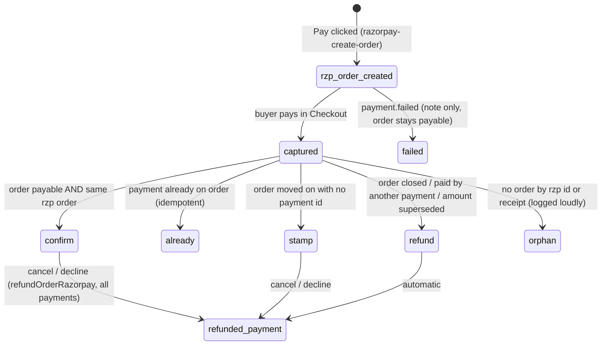
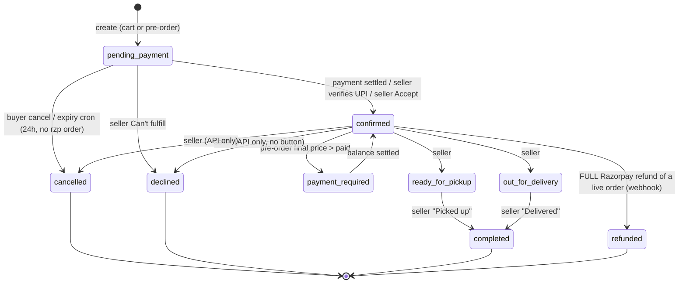
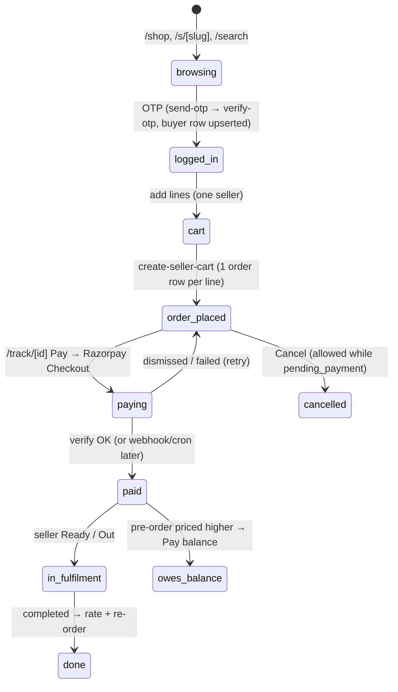
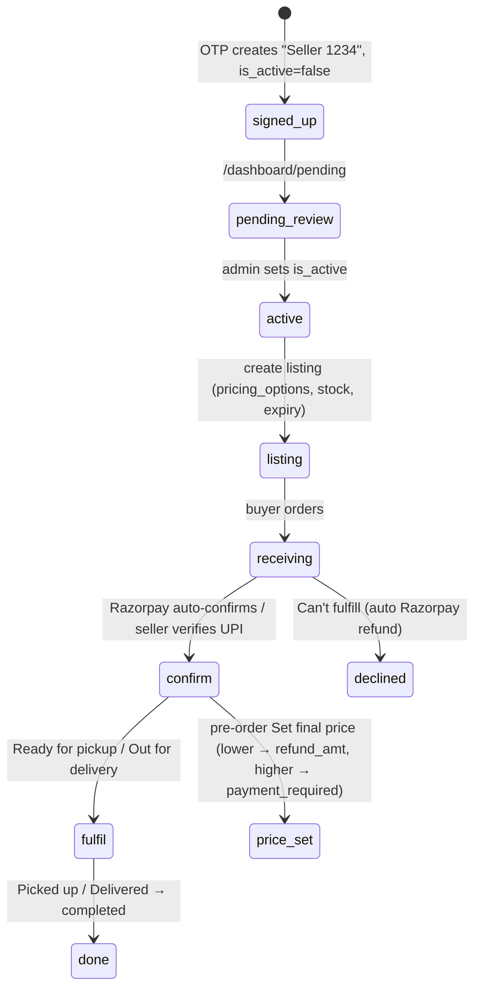

# Relifish system audit — data, state machines, drift, cleanup

Audited 2026-10-08 against **production** Supabase (`witoghpdfocywiosmrzv`, read-only
queries) and the code on branch `kunalrawat425/buyer-contact-leak`.

Status legend: **FIXED** (committed on this branch) · **MIGRATION** (written, not yet
applied to prod) · **OPEN** (identified, not fixed yet).

---

## 1. Data inventory

| Table | Rows | Purpose | Verdict |
|---|---|---|---|
| `orders` | 337 | One row per order line (cart = N rows) | Keep. ~320 rows are test data (§6) |
| `fish_listings` | 68 | Seller stock + `pricing_options` jsonb | Keep. 61 expired but `is_available=true` |
| `sellers` | 24 | Seller profile, hours, delivery config | Keep. 16 are empty OTP sign-ups ("Seller 1234") |
| `buyers` | 25 | Buyer profile, push subscription | Keep |
| `buyer_addresses` | 4 | Saved addresses | Keep. Orders reference it by uuid **in a text column** |
| `buyer_cart` | 1 | Server-side cart | Keep. 1 row points at an unavailable listing |
| `order_feedback` | 4 | Ratings | Keep. Now drives `sellers.rating_*` (070) |
| `otp_codes` | 40 | Current OTP per phone | Keep. Expired plaintext codes purged (070) |
| `push_notification_logs` | 109 | Push delivery audit | Keep. Add retention later |
| `buyer_waitlist` | 8 | Pre-launch waitlist | Keep. `converted_at` never written |
| `species_ranges` | 21 | Admin price bands | Keep |
| `razorpay_payments` | new | Ledger: one row per captured payment | **MIGRATION 069** |
| `otp_attempts` | 10 | Old OTP rate limit (018) | **Drop — MIGRATION 070.** Replaced by `otp_codes` in 052, never removed |
| `price_logs` | 0 | Nothing reads or writes it | **Drop — MIGRATION 070** |
| `seller_schedule_slots` | 0 | Scheduled pickup slots | Feature disabled (create returns 400). Keep for now: `orders.schedule_slot_id` FKs it |
| `seller_schedule_configs` | 0 | Slot config | Same as above |

**Missing table** — there was no record of individual payments. An order holds one
`razorpay_payment_id`, so a pre-order paid upfront + balance lost the first id, and a
payment that arrived after cancel was recorded nowhere. → `razorpay_payments` (069).

`auth.users` is **empty**: nobody uses Supabase Auth. Every RLS policy written against
`auth.uid()` (`get_seller_id()`, `get_buyer_id()`, `is_admin()`) is dead code.

### Unused or redundant columns

| Column | Evidence | Verdict |
|---|---|---|
| `orders.payment_type` | Hardcoded `'cod'` on every create, never updated; all 8 Razorpay rows read "cod" | **FIXED / 069**: derived from `payment_method` by trigger |
| `orders.platform_fee` | 0 on all rows (commission is 0%) | OPEN: drop when convenient |
| `orders.seller_upi_id` | 0 rows, 0 code refs | OPEN: drop |
| `orders.schedule_slot_id` / `scheduled_for` | 0 / 2 rows; feature off | OPEN: drop with schedule tables if the feature is abandoned |
| `orders.refund_screenshot_path` | 0 rows | Keep (UPI refund proof path is live code) |
| `orders.is_preorder` + `placement_kind` | Same fact twice. 0 mismatches today, but two writers | OPEN: derive one from the other |
| `orders.species` | Copy of `fish_listings.species` | Keep: snapshot survives listing deletion |
| `orders.buyer_addr` | 214 uuids into `buyer_addresses` (4 dangling) + 74 free-text | OPEN: store an address **snapshot** at order time |
| `orders.payment_verified_by` | 17 set, FK to sellers | Keep |
| `fish_listings.delivery_avl` | 0 code refs | OPEN: drop |
| `sellers.low_stock_threshold` | 0 code refs (set on 24 rows by default) | OPEN: drop or wire up |
| `sellers.rating_avg`, `total_orders` | Shown publicly, **never written** | **FIXED / 070**: triggers + `rating_count` |
| `buyer_waitlist.converted_at` | Never written | OPEN |

---

## 2. Table optimisation scope

Size is not the problem: the largest table is 312 kB. Correctness is.

| Item | Why | Status |
|---|---|---|
| Unique `orders.razorpay_order_id` / `razorpay_payment_id` (partial, not null) | Webhook and refund look up by these; duplicates would mis-route money. 0 dupes today | **MIGRATION 069** |
| `orders(listing_id, status, created_at desc)` | Seller dashboard filters exactly this | OPEN (cheap, add with lockdown) |
| `orders(buyer_id, created_at desc)` | Buyer /me, /track | OPEN |
| Drop `idx_buyers_auth` | Duplicate of unique `buyers_auth_id_key`; and auth_id is always null | OPEN |
| Unused indexes per advisor: `idx_orders_scheduled`, `idx_listings_available`, push log indexes | Never scanned | OPEN, low value |
| 5 unindexed FKs (advisor) | Tiny tables; only `orders.payment_verified_by` matters for deletes | OPEN, low value |
| `search_path` not pinned on 10 functions | Advisor WARN; hijackable search path | OPEN (lockdown migration) |
| RLS policies calling `auth.uid()` per row | Advisor WARN — and they are dead anyway | OPEN (lockdown migration) |
| No migration tracking on prod (`_migrations` absent) + duplicate numbers 028/029/051/054 | Prod schema drifted from staging before (see BUG-LIST "Schema drift") | OPEN |

---

## 3. Out-of-sync and duplicated data (the "otp_codes vs otp_attempts" pattern)

Every place two copies of a fact can disagree, checked on prod:

| # | Pattern | Prod evidence | Status |
|---|---|---|---|
| 1 | `otp_attempts` vs `otp_codes` — two tables claiming attempt counts | `otp_attempts` last write 2026-05-03; 5/10 rows for phones `otp_codes` never saw | **FIXED / 070** (dropped) |
| 2 | Phone format: `otp_codes` "91XXXXXXXXXX", buyers/sellers 10-digit, orders mixed | orders: 218 `+91…`, 117 10-digit, 2 garbage | **FIXED / 070** (normalise on write + backfill) |
| 3 | `payment_type` vs `payment_method` | 8/8 Razorpay rows say "cod" | **FIXED / 069** |
| 4 | `sellers.rating_avg` vs `order_feedback` | 2 sellers disagree | **FIXED / 070** |
| 5 | `sellers.total_orders` vs completed orders | 5 sellers disagree; SEO `ratingCount` used it | **FIXED / 070** |
| 6 | `orders.razorpay_payment_id` vs actual Razorpay payments | Second/late payments recorded nowhere | **FIXED / 069** (ledger) |
| 7 | `orders.buyer_addr` uuid vs `buyer_addresses` | 4 orders point at deleted addresses → delivery address lost | OPEN (snapshot) |
| 8 | `orders.paid_amount` = what is **owed**, set at INSERT | Read as "paid" in 3 UI places (BUG-42 class) | **FIXED** in /track, seller card, detail |
| 9 | `fish_listings.is_available` vs `expires_at` | 61 expired listings still `is_available=true` | OPEN (readers filter by expiry; cron should flip) |
| 10 | `orders.inventory_deducted` vs status | 21 `completed` rows never marked deducted (pre-067 history) | Leave: historical, 068 deliberately skips terminal rows |
| 11 | `refund_sent_at` without `refund_amt` | 8 rows | OPEN (mark_refund_sent should store the amount) |
| 12 | `final_price` on non-pre-orders | 20 rows | OPEN (set_final_price guard is meaningless, see §5) |
| 13 | `status='cancelled'` without `cancelled_by` | 4 rows (expiry cron) | OPEN |
| 14 | `send-otp` daily cap 30 vs message "3" | Code constant vs copy | **FIXED** (10, message from constant) |
| 15 | Buyer email written from client JSON in verify | Unverified email can land on `buyers.email` | OPEN (session lockdown) |

---

## 4. Other bad patterns found

| Pattern | Where | Status |
|---|---|---|
| OTP from `Math.random` over 4 patterns — ~1,458 codes, not 1,000,000 | `send-otp.ts` | **FIXED** |
| OTP payload (with the code) `console.log`ged | `send-otp.ts` | **FIXED** |
| Missing MSG91 env → `123456` logs into any account | `verify-otp.ts` | **FIXED** (fail closed) |
| Anon key can `SELECT *` every order (phone, address text, notes) | RLS `USING (true)` | OPEN — lockdown |
| Seller dashboard Realtime subscribes to **all** orders | `dashboard/orders/index.astro:457` | OPEN — lockdown |
| "Auth" = id + phone from localStorage; seller phones are public | `assert-seller.ts`, every seller API | OPEN — session tokens (D3) |
| `reconcile_preorder_price` callable by anon, no auth check | DB function | OPEN — lockdown |
| Anon can INSERT orders with any status | RLS `with check (true)` | OPEN — lockdown |
| Write-then-forget UPDATEs with no status guard (race = wrong state) | `cancel.ts:68`, `seller/orders.ts:375` | OPEN — §5 |
| Cart checkout not atomic: line N fails after 1..N-1 created | `create-seller-cart.ts` | OPEN |
| `upload-payment` deletes old files before the DB write; clears `payment_verified_at` on confirmed orders | `upload-payment.ts` | OPEN |
| Server never checks `seller.is_active` / `listing.is_order_paused` at order time | create paths | OPEN |
| Dead code: `/api/orders/create` (no UI caller), `/api/preorders`, `accept_price`/`reject_price`, 8 helpers in `lib/supabase.ts`, bulk-verify button | various | OPEN — delete |

---

## 5. State machines

### 5.1 Payment state machine (per Razorpay payment)

Since 069/the settle module, every captured payment goes through
`settleCapturedPayment` (`src/lib/server/razorpay-ledger.ts`) no matter who sees it first
(verify, webhook, daily cron, admin, seller "Check Razorpay", create-order).

| Order payment view | Meaning | Shown as |
|---|---|---|
| `payment_method=razorpay` + `razorpay_payment_id` | captured online | "Paid online · Razorpay" + ref |
| `payment_verified_at`, no razorpay | seller verified UPI | "Paid via UPI · verified by seller" |
| screenshot only | buyer claims UPI | "UPI proof submitted — seller will verify" |
| `payment_method=cod_legacy` | pre-Razorpay legacy | "Cash on delivery (legacy order)" |
| none | unpaid (`paid_amount` is only what is owed) | "Payment pending" |

### 5.2 Order state machine (`orders.status`)

Live statuses only. **Dead** (no code writes them): `paid`, `picked_up`, `scheduled`,
`pending`, `pre_order`. They exist in the check constraint and UI maps only.

Side effects: stock deducted on insert (same-day) or on → `confirmed` (pending_payment /
pre-order); restored on → `cancelled`/`declined`/`refunded` if it was deducted (067).

**Stuck / wrong exits still OPEN**
- Seller API: statuses missing from the allowed-transition map skip the check, so
  `cancelled → confirmed` is accepted (`seller/orders.ts:276-313`). `refunded` allows
  `ready_for_pickup`/`out_for_delivery`.
- No status guard on the seller UPDATE or buyer cancel UPDATE → cancel racing "Ready"
  can leave a refunded order `ready_for_pickup`.
- `pending_payment` with a Razorpay order but never paid: expiry cron skips it forever.
- `pending_payment` with an unverified UPI screenshot: cron cancels it after 24h.
- Pre-order "Set price" never appears for UI-created pre-orders (cart sets
  `delivery_fee=0`, `paid=total`, the button needs `paid < total+delivery`).
- `reject_price` (no UI) cancels from any status with `final_price`, including `completed`.
- **FIXED:** refund webhook no longer flips cancelled/declined/completed → `refunded`;
  verify accepts `payment_required`; balance top-up can be paid; late/extra payments refunded.

### 5.3 Buyer journey

| Status | /track/[id] buyer sees | /me |
|---|---|---|
| pending_payment | Pay + Cancel | Active, "Complete payment" |
| confirmed | Cut/notes form, payment label + ref | Active |
| payment_required | Pay balance (**now payable**) | Active |
| ready / out | Read-only | Active |
| completed | Rate + Re-order | Past |
| cancelled / declined | Refund block only if actually paid | Past |
| refunded | "Order closed — payment refunded" (**was "confirmed — being prepared"**) | Past |

### 5.4 Seller journey

| Dashboard tab | Statuses | Actions |
|---|---|---|
| New | pending, pending_payment, pre_order, scheduled | Razorpay unpaid: Check Razorpay, Can't fulfill. Paid-but-pending: **Confirm order** (was Ready/Out, which the server rejected). UPI: View proof, Verify, Can't fulfill |
| In progress | confirmed, paid, payment_required, ready_for_pickup, out_for_delivery | Ready / Out / Picked up / Delivered, Set price, Mark refund sent |
| History | picked_up, completed, declined, cancelled, refunded | Mark refund sent (UPI, if actually paid) |

---

## 6. Test data on production

| Group | Identification | Rows |
|---|---|---|
| Fake sellers | Fishy mart / Fresh Catch Mumbai / RAJU Fish HUb (`98765432 10/11/12`), Seller 0033 (`9900110033`) | 4 sellers, 13 listings, 252 orders |
| Fake buyers | `99001100{11,22,33,44,55}`, `9876543210`, `9999999999` | 7 buyers, 17 orders |
| Dev account | `…9974`: buyer + admin seller "Seller 9974" | 302 orders (7 Razorpay-paid, real money) |
| Empty sign-ups | "Seller NNNN", 0 listings, inactive | 16 sellers |
| Keep | Bombay Sea Food, Ocean Lovers Fish, The fishy spot, buyer `…1990` | ~16 orders |

Decision D2=A: back up, then delete including the 7 Razorpay-paid dev rows. Every
delete runs only after explicit approval (D5=A). The ₹1 test seller is the dev seller
renamed `TEST Relifish QA`, flagged `is_test`, hidden from public lists.

**Convention from now on:** `is_test boolean` on `sellers`, `buyers`, `orders` (orders
inherit it from seller or buyer by trigger), display names prefixed `TEST `. Public
queries filter `is_test = false`. Cleanup is one statement per table in FK order.

---

## 7. Edge cases to test (E2E matrix, staging)

- Concurrency: buyer cancel vs seller Ready; double-click Decline on a Razorpay order;
  two Set-price requests; webhook vs verify (only the winner notifies).
- Payment after cancel/decline → automatic refund + note (**now handled**).
- Two tabs paying the same order → second payment refunded (**now handled**).
- Pre-order price up (balance via Razorpay) and down (refund_amt) — both pickup and delivery.
- Stock at 0: two pending_payment orders both confirm (no reservation).
- Seller paused/inactive while an order is placed; cutoff across IST midnight.
- OTP: wrong code ×3, resend cooldown, daily cap, MSG91 disabled on prod (must 503).
